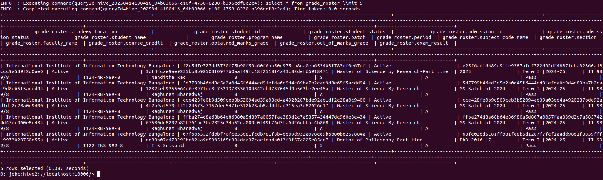

## Question-2

We have created schema for the tables in Q1 along with basic cleaning, and now we want to create dimensional and fact tables for the dimensional modelling. To do so, we have to define their schemas as done in Q1 along with the fact table.     
Since, it is a dimensional modelling, we have to pre-process the data and perform joins to form the fact table. Thus, some additional pre-processing will be required, specially on the subject names as all the three files have different structures of defining them altogether. Typically, fact tables are a formed as a result of join on student id and course/subject name. Thus, the course/subject name needs to be pre-processed in the hiveql, so it has similar contents which essentially belong to the same course. The data is from various sources like erp, codetantra and/or LMS, thus creating different values for the same subjects.   
The typical pre-processing steps that we had one are in pre-processing.hql. The details of these pre-processing along with reasoning are as follows:
1. **Standardization of Text Format**

- **Convert to Lowercase:**
    - Using functions like LOWER() to convert all subject/course names to lowercase.
    - Reason: Ensures that differences in capitalization (e.g., "Maths" vs. "maths") do not create duplicate keys.

- **Trim Whitespaces:**
    - Apply the TRIM() function to remove leading and trailing spaces from text fields, especially trimming around delimiters like **/** and **-**, as evident in enrollment and grade data course fields.
    - Reason: Removes accidental spaces that could lead to mismatches during joins.

- **Uniform Delimiter Replacement:**
    - Use REGEXP_REPLACE() to standardize delimiters (like replacing hyphens, slashes, or multiple spaces with a single delimiter /). This is done to separate course code with course name.
    - Reason: Multiple representations (e.g., "CSE-101", "CSE/101", "CSE 101") get unified to a single format.

2. **Issues with attendance data:**
- **Uneven course_name in attendance data:**
    - Courses like "T1-24-25-AMS 211-Mathematics-3" are there in those fields, which should be ideally be "AMS 211-Mathematics-3" to maintain homogenity with other tables.
    - There are multiple rows which has email as **vishnu.raj@iiitb.org**. Those columns are essentially faculty meetings, and those rooms are removed and added to error_logs table, since they are erroneous values. 
    - Some course names do not have any course code, and are essentially random staff/board meeting like **Audio testing Meeting by Prof  Chandrashekar Ramanathan**. Those rows are removed from the table and added into error_logs table, since they are erroneous values.
- **Courses specifying batches:**
    - For courses with regard to first years, in some places they have mentioned batches they are teaching like **T1-24-25-GNL 101-English(BT1-IMT1-CSE)**. So, I have removed the contents of the brackets except the ones which are programming courses like **T1-24-25-EGC 111-Programming 1A (C Programming)(BT1-IMT1)**.

3. **Final Course Details:**
- Now all the dimension tables have courses like **AMS 211/Mathematics-3**, meaning / is seperating the course code and course name.
    - Now, we could not merge directly with course codes since many rows are those of **programming and labs which have same course code**, but should have seperate grading and attendace records. Thus, standardisation of data across all the tables was required.

The hql queries for pre-processing is in **pre-processing.hql**.   
Some images regarding sql queries done for pre-processing and data analytics are as follows:-





What we did was first write the python script for all the dimensional tables and pre-processed it such that on doing inner join, we will get maximum rows in the fact table. Now, the fact table has **2771 rows**, which would have been **less than 1000** without pre-processing. Then, we backtracked and form the hql queries and reported it in hql file.      
The structure of fact tables is as follows:

```
CREATE TABLE IF NOT EXISTS fact_table (
    member_id STRING,
    course STRING,
    number_of_classes_attended INT,
    number_of_classes_absent INT,
    course_credit INT,
    average_attendance_percent FLOAT
)
ROW FORMAT SERDE 'org.apache.hadoop.hive.serde2.OpenCSVSerde'
WITH SERDEPROPERTIES (
  "separatorChar" = ",",
  "quoteChar"     = "\""
)
STORED AS TEXTFILE
TBLPROPERTIES ("skip.header.line.count" = "1");
```

The structure of all the dimension tables as defined in Q1 are as follows:-
```
CREATE TABLE IF NOT EXISTS dim_enrollment_data (
  serial_no INT,
  course_type STRING,
  student_id STRING,
  student_name STRING,
  program STRING,
  batch STRING,
  period STRING,
  enrollment_date STRING, 
  primary_faculty STRING,
  subject_code_name STRING,  
  section STRING
)
ROW FORMAT SERDE 'org.apache.hadoop.hive.serde2.OpenCSVSerde'
WITH SERDEPROPERTIES (
  "separatorChar" = ",",
  "quoteChar"     = "\""
)
STORED AS TEXTFILE
TBLPROPERTIES ("skip.header.line.count"="1");


CREATE TABLE IF NOT EXISTS dim_grade_roster (
    academy_location STRING,
    student_id STRING,
    student_status STRING,
    admission_id STRING,
    admission_status STRING,
    student_name STRING,
    program_name STRING,
    batch STRING,
    period STRING,
    section STRING,
    faculty_name STRING,
    course_credit INT,
    obtained_marks_grade STRING,
    out_of_marks_grade STRING,
    exam_result STRING,
    subject_code_name STRING
)
ROW FORMAT SERDE 'org.apache.hadoop.hive.serde2.OpenCSVSerde'
WITH SERDEPROPERTIES (
    "separatorChar" = ",",
    "quoteChar"     = "\""
)
STORED AS TEXTFILE
TBLPROPERTIES ("skip.header.line.count"="1");

CREATE TABLE IF NOT EXISTS dim_attendance_data (
    course STRING,
    instructor STRING,
    name STRING,
    email_id STRING,
    member_id STRING,
    number_of_classes_attended INT,
    number_of_classes_absent INT,
    average_attendance_percent FLOAT
)
ROW FORMAT SERDE 'org.apache.hadoop.hive.serde2.OpenCSVSerde'
WITH SERDEPROPERTIES (
    "separatorChar" = ",",
    "quoteChar"     = "\""
)
STORED AS TEXTFILE
TBLPROPERTIES ("skip.header.line.count"="1");
```

Firstly, we mount the csv files into the docker image folder, so as to use it for populating tables with the data.

Then, we load the csv dataset into the above schema.    
The code for loading it into hql table schemas is in load_queries.hql    
The corresponding hql output after loading, and select statements are as follows:   


Fater this is done, we try three HiveQl analytic queries. I have utilised these three queries since it covers the utility of all the numerical columns in the dimension and fact tables.

Before starting off, since we are utilising hive as a docker image due to various issues in the instllation as faced by many others, we are storing the tables everytime in our local system.
So, first we load csv of dimensional tables and fact table onto the docker image:
docker cp attendance.csv hive4:/tmp/dim_attendance.csv   
docker cp enrollment.csv hive4:/tmp/dim_enrollment.csv
docker cp grade.csv hive4:/tmp/dim_grade.csv
docker cp fact_table_final.csv hive4:/tmp/fact_table.csv


### Query-1
**Objective:**  
To compute the CGPA (Cumulative Grade Point Average) for each student based on the grade obtained and course credits.

**Approach:**  
- Join `dim_grade_roster` and `fact_table` on `student_id` and `subject_code_name`.
- Use a weighted sum of grade points (based on institutional grading system) multiplied by `course_credit`.
- Divide total weighted grade points by total credits to derive CGPA.
- Order results by CGPA and then by total credits in descending order.

**Query**
```
SELECT 
  g.student_id,
  SUM(g.course_credit) AS total_credits_completed,
  SUM(CASE 
        WHEN g.obtained_marks_grade = 'A'  THEN 4.0 * g.course_credit
        WHEN g.obtained_marks_grade = 'A-' THEN 3.7 * g.course_credit
        WHEN g.obtained_marks_grade = 'B+' THEN 3.4 * g.course_credit
        WHEN g.obtained_marks_grade = 'B'  THEN 3.0 * g.course_credit
        WHEN g.obtained_marks_grade = 'B-' THEN 2.7 * g.course_credit
        WHEN g.obtained_marks_grade = 'C+' THEN 2.4 * g.course_credit
        WHEN g.obtained_marks_grade = 'C'  THEN 2.0 * g.course_credit
        WHEN g.obtained_marks_grade = 'D'  THEN 1.7 * g.course_credit
        ELSE 0.0
      END) / SUM(g.course_credit) AS cgpa
FROM dim_grade_roster g
JOIN fact_table f 
  ON g.student_id = f.member_id 
  AND g.subject_code_name = f.course
GROUP BY g.student_id
ORDER BY cgpa DESC, total_credits_completed DESC;
```
**Use Case:**  
This query is essential for academic performance analysis, ranking students, and eligibility for honors or scholarships.


**Time Elapsed: 6.54 seconds**

### Query-2
**Objective:**  
To determine the number of students taught, average attendance, and maximum course credit for each faculty.

**Approach:**  
- Join `dim_grade_roster` and `fact_table` on student and course.
- Filter for only those students who have passed (`exam_result = 'Pass'`).
- Aggregate data to:
  - Count distinct students per faculty.
  - Calculate average attendance using `average_attendance_percent`.
  - Determine the highest credit course taught by each faculty.

**Use Case:**  
This helps analyze faculty engagement, workload distribution, and effectiveness in teaching based on student attendance and course difficulty.

**Query:**
```
SELECT 
  g.faculty_name,
  COUNT(DISTINCT g.student_id) AS num_students,
  AVG(f.average_attendance_percent) AS avg_attendance,
  MAX(g.course_credit) AS max_course_credit
FROM fact_table f
JOIN dim_grade_roster g 
  ON f.member_id = g.student_id 
     AND f.course = g.subject_code_name
WHERE g.exam_result = 'Pass'
GROUP BY g.faculty_name;
```


**Time Elapsed:0.912 seconds**

### Query-3

**Objective:**  
To identify students who have an attendance percentage below 75% in any course.

**Approach:**  
- Join `dim_grade_roster` and `fact_table` on `student_id` and `subject_code_name`.
- Calculate overall attendance percentage as (classes_attended / (attended + absent)) * 100:
- Filter (`HAVING`) to return only those records with less than 75% attendance.

**Query**:
```
SELECT 
    g.student_id,
    g.subject_code_name AS course,
    SUM(f.number_of_classes_attended) AS total_classes_attended,
    SUM(f.number_of_classes_absent)  AS total_classes_absent,
    (SUM(f.number_of_classes_attended) * 100.0) / (SUM(f.number_of_classes_attended) + SUM(f.number_of_classes_absent)) AS overall_attendance_percentage
FROM fact_table f
INNER JOIN dim_grade_roster g
  ON f.member_id = g.student_id 
  AND f.course = g.subject_code_name
GROUP BY 
    g.student_id, 
    g.subject_code_name
HAVING 
    (SUM(f.number_of_classes_attended) * 100.0) / (SUM(f.number_of_classes_attended) + SUM(f.number_of_classes_absent)) < 75;
```

**Use Case:**  
Used for academic warnings, eligibility checks for exams, and enforcing minimum attendance policies.


**Time Elapsed:1.23 seconds**

### Note: You might be seeing that I am using only two tables in the queries, but since the fact table contains all the numerical data regarding attendance, thus **dim_attendance** table is not used. Similarly enrollment data had no numerical values, thus it is not part of join, as there cannot be any analytical query possible.

## Error logs

The error_log.csv in the output folder of Q2 contains the inconsistent and erroneous data that we found out earlier. Since, the rest of the data was pre-processed and retained in the table, only erroneous values in the attendance table has been copied to the error_logs table.  

```
INSERT INTO TABLE error_log
SELECT *
FROM a_data
WHERE (course NOT REGEXP '[0-9]' OR email_id = 'vishnu.raj@iiitb.org');

INSERT OVERWRITE DIRECTORY '/tmp/error_log_csv'
ROW FORMAT DELIMITED
FIELDS TERMINATED BY ','
SELECT * FROM error_log;

docker cp hive4:/tmp/error_log_csv/000000_0 ./error_log.csv
```


