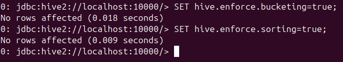

## Question-3

Now on running the hiveql, we set Hive properties for dynamic bucketing:

1. SET hive.enforce.bucketing=true;
2. SET hive.enforce.sorting=true;

### Query-1

### Query-2

### Query-3
